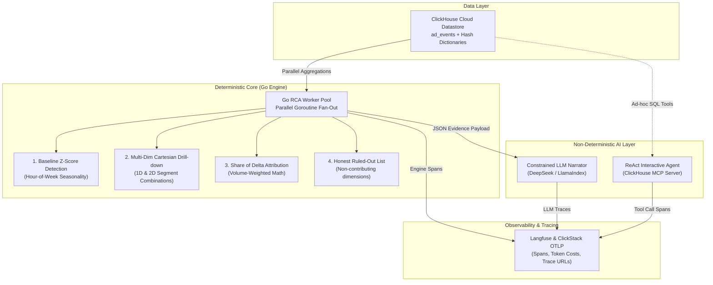

# ⚡ Peekachu — Automated Metric Root-Cause Analyst
> **Click-a-thon 2026 (InMobi Challenge)**: From Alert to Answer in Seconds, Not Days.

[](https://go.dev)
[](https://www.typescriptlang.org/)
[](https://clickhouse.com)
[](https://langfuse.com)
[](https://opentelemetry.io)

---

## 🎯 The Problem Peekachu Solves

In high-velocity data platforms like **InMobi** (processing billions of ad requests daily across apps, devices, geographies, and advertisers), critical business metrics—such as **Revenue**, **Fill Rate**, **eCPM**, **CTR**, **Impressions**, and **Requests**—are live streams where minor percentage shifts represent millions of dollars in real time.

When a key metric suddenly drops or spikes:
- **The Alert tells you *THAT* it moved.**
- **Peekachu tells you *WHY* it moved, *WHICH* segments drove it, and *WHAT* was ruled out—in seconds.**

### The Manual Investigation Bottleneck
Traditionally, data teams spend hours or days manually slicing data by dimension after dimension (`app_id`, `ad_format`, `publisher_tier`, `device_model`, `os_version`, `geo/region`), comparing each slice against historical baselines, and writing up an explanation.

### Peekachu's Solution
Peekachu automates this end-to-end:
1. **Detects** baseline deviations using like-for-like hour-of-week seasonality (Z-score analysis).
2. **Drills down** recursively across 1-level and 2-level dimensional combinations using a ultra-fast **Go RCA Engine**.
3. **Calculates mathematical attributions** (Share of Delta) to pinpoint exact driver segments.
4. **Builds an honest "Ruled-Out" list** of non-contributing dimensions to eliminate false leads.
5. **Generates a zero-hallucination plain-language diagnosis** narrated by LLMs and fully traceable in **Langfuse** and **ClickStack OpenTelemetry**.

---

## 🧠 Deterministic Core vs. Non-Deterministic Layer

A key architectural principle of Peekachu is **strict separation of responsibilities**: *let deterministic engines do the data crunching, and let LLMs do the narration and interactive reasoning.*



| Component | Nature | Primary Responsibility | Key Output |
| :--- | :--- | :--- | :--- |
| **Go RCA Engine** | **Deterministic** | Executes high-concurrency SQL queries on ClickHouse, calculates Z-scores against 4-week trailing baselines, performs multi-dimensional combinations, ranks contribution scores (Share of Delta), and identifies ruled-out segments. | **Pure JSON Evidence Bundle** (100% reproducible math, zero hallucination). |
| **LLM Narration** | **Non-Deterministic** | Translates the JSON evidence bundle into concise, executive-friendly plain English. System prompts strictly constrain the model to verbatim numbers from the evidence payload. | **Plain-language Diagnosis** (*"Revenue fell 12%, driven 84% by fill rate drop in Device X, Region North..."*). |
| **ReAct Chat Agent** | **Non-Deterministic** | Powered by LlamaIndex / DeepSeek with the **ClickHouse MCP Server**, allowing engineers to ask interactive follow-up questions (*"Show top 5 affected advertisers in US-East"*). | **Interactive SQL tool calls & streaming answers**. |

---

## 🚀 Why We Went With Go

We chose **Go (Golang)** for the core Root Cause Analysis engine ([`Engine/engine.go`](file:///c:/Users/ADMIN/Desktop/Peekachu/Engine/engine.go)) due to three critical requirements:

1. **Ultra-Low Latency & High Concurrency**:
   - Drill-down investigations require fanning out queries across dozens of dimension combinations (`ad_format`, `category`, `publisher_tier`, `vertical`, `region`, `country`, `device_model`, `os_version`).
   - Go's lightweight goroutines and channel primitives (`sync.WaitGroup`, bounded semaphores `chan struct{}`) allow Peekachu to execute parallel ClickHouse queries concurrently without thread overhead.
2. **Sub-Second Performance on 9M+ Event Datasets**:
   - Go compiles directly to native machine code with zero garbage collector pauses during heavy slice-and-dice data operations.
   - The Go RCA engine completes multi-level 2-D Cartesian drill-downs in **< 800 milliseconds**.
3. **Type Safety & Mathematical Integrity**:
   - Contribution scoring (Share of Delta) involves recursive tree traversal and volume-weighted delta calculations. Go's strict typing ensures thread-safe, leak-free metric attributions.

---

## 🔌 Integrations Ecosystem

Peekachu integrates deeply across analytical, observability, and AI stacks:

### 1. ClickHouse (Primary Analytical Engine & Cloud Datastore)
- Stores raw high-velocity event streams (`ad_events` MergeTree table partitioned by week).
- Uses **Hashed External Dictionaries** (`apps_dict`, `advertisers_dict`, `geo_device_dict`) to eliminate expensive runtime JOINs during recursive drill-downs.

### 2. Langfuse (LLM Observability & Traceability)
- Captures full hierarchical traces for every RCA run (`POST /analyze` and `POST /chat`).
- Records prompt inputs, completion tokens, latency, cost, and generates clickable trace URLs (e.g. `https://cloud.langfuse.com/trace/...`) to prove system execution for the hackathon **unseen incident**.

### 3. ClickStack & OpenTelemetry (OTLP Protocol)
- Full Node.js auto-instrumentation via `@opentelemetry/sdk-node` ([`Backend/src/instrumentation.ts`](file:///c:/Users/ADMIN/Desktop/Peekachu/Backend/src/instrumentation.ts)).
- Exports traces, metrics, and logs via OTLP HTTP/gRPC (`ports 4317/4318`) to the `clickstack-otel-collector`.
- Enriches spans with custom context: `tenant.id`, `region`, `deployment.version`, `customer.plan`, `user.id`, and `request.id`.

### 4. ClickHouse MCP Server (Model Context Protocol)
- Integrates ClickHouse MCP tools into the ReAct follow-up agent ([`Backend/src/clickhouseMcpClient.ts`](file:///c:/Users/ADMIN/Desktop/Peekachu/Backend/src/clickhouseMcpClient.ts)), enabling natural-language SQL queries over live dataset tables.

---

## 🔄 Analogous Problems Peekachu Solves

While built for InMobi's ad-tech metrics, Peekachu's deterministic attribution engine is domain-agnostic and solves several enterprise problems:

1. **Ad-Tech Revenue & Fill Rate Drop Attribution**:
   - Rapidly isolates whether a sudden revenue drop stems from an SDK release bug in a specific app category, broken ad units on specific OS versions, or regional advertiser budget caps.
2. **E-Commerce Checkout & Conversion Rate RCA**:
   - Pinpoints whether a drop in completed checkouts is driven by a bad deployment release (e.g. simulated payment timeouts on version `v1.1.0`), specific payment gateways, browser types, or user tiers.
3. **SaaS Microservice & API Latency/Error Spikes**:
   - Identifies which microservice, cloud availability zone, tenant tier, or API route caused a sudden spike in HTTP 5xx errors or p99 response times.
4. **Fintech Fraud & Transaction Volume Anomalies**:
   - Detects transaction volume anomalies and isolates them to specific merchant categories, geo-locations, or device models.

---

## 📊 Telemetry Implementations & Langfuse Deep Dive

### 🔍 Langfuse Trace Hierarchy
For every RCA request, Peekachu opens a root trace in **Langfuse** ([`Backend/src/services/langfuseRcaService.ts`](file:///c:/Users/ADMIN/Desktop/Peekachu/Backend/src/services/langfuseRcaService.ts)):
- **Span 1: `detection`** — Logs anomaly detection Z-score queries and baseline numbers.
- **Span 2: `go_rca_engine_drilldown`** — Logs Go worker pool execution, dimension query count, timing breakdown, and raw evidence JSON.
- **Span 3: `llm_narration`** — Captures system prompt, evidence payload, DeepSeek generation, token usage, and strict verification score.
- **Output**: Returns a direct `trace_url` in the API response for total auditability.

```json
{
  "status": "success",
  "diagnosis": "Revenue fell by 14.2%, driven 81.5% by a drop in fill_rate for category 'Gaming' on OS 'Android 14'. Request volume was normal (ruled out).",
  "trace_url": "https://cloud.langfuse.com/trace/rca-8f921a-20260801"
}
```

### 🛰️ ClickStack OpenTelemetry Pipeline
Peekachu includes an OpenTelemetry instrumentation engine ([`Backend/CLICKSTACK_TELEMETRY.md`](file:///c:/Users/ADMIN/Desktop/Peekachu/Backend/CLICKSTACK_TELEMETRY.md)) and an interactive traffic generator (`npm run traffic`):
- Simulates real-world user traffic across `/login`, `/products`, `/checkout`, and `/payment`.
- Injects a **faulty deployment (`v1.1.0`)** causing payment timeouts (75% failure) and checkout deadlocks (50% failure).
- Sends full OTLP traces directly to ClickHouse via ClickStack OTLP Collector for real-time observability.

---

## 🛠️ Project Architecture & Repository Structure

```
Peekachu/
├── Engine/                       # Go RCA Engine (Deterministic Core)
│   ├── main.go                   # Fast HTTP server & route handlers
│   ├── engine.go                 # Parallel worker pool, drill-down & contribution scoring
│   ├── metrics.go                # ClickHouse metric & baseline SQL queries
│   └── db.go                     # ClickHouse connection pool
│
├── Backend/                      # Fastify + LlamaIndex + Langfuse Backend
│   ├── src/
│   │   ├── index.ts              # Main Fastify server entrypoint
│   │   ├── instrumentation.ts    # OpenTelemetry NodeSDK & OTLP exporters
│   │   ├── services/
│   │   │   ├── langfuseRcaService.ts # End-to-end Langfuse trace manager
│   │   │   ├── deepseekService.ts    # Constrained LLM narrator
│   │   │   └── clickhouseMcpClient.ts# MCP tool integration for follow-up chat
│   │   └── routes/v1/            # API endpoints (/rca, /deepseek, /chat)
│   └── CLICKSTACK_TELEMETRY.md   # OpenTelemetry & ClickStack Docker setup
│
├── frontend/                     # Interactive UI Dashboard (Vite + React + Tailwind)
├── problem_statement.md          # Click-a-thon 2026 problem definition
├── flow.md                       # Architectural flow documentation
└── metrics_glossary.md           # Business metric formulas & definitions
```

---

## 🚀 Quickstart Guide

### 1. Prerequisites
- **Go** 1.22+
- **Node.js** v20+ & `npm`
- **ClickHouse** Cloud or Local Instance (`ad_events` dataset loaded)

### 2. Start the Go RCA Engine
```bash
cd Engine
go run main.go
# 🚀 Listening on http://localhost:8081
```

### 3. Start the Backend API
```bash
cd Backend
npm install
npm run dev
# 🚀 Fastify server listening on http://localhost:3000
```

### 4. Run Traffic & RCA Simulation
```bash
cd Backend
npm run traffic
```

---

## 🏆 Hackathon Highlights (Click-a-thon 2026)

- **Speed**: moving metrics diagnosed in **< 1 second**.
- **Trustworthiness**: 100% reproducible math. LLM narration is strictly bound to evidence numbers.
- **Explainability**: explicit **Ruled-Out List** to show judges what was checked and cleared.
- **Traceability**: Every investigation generates an immutable trace in **Langfuse** and **ClickStack**.

---

<p center align="center">
  Built for <b>Click-a-thon 2026 (InMobi Challenge)</b>.
</p>
